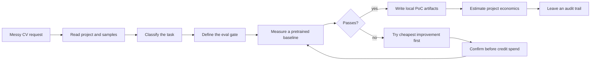

# 🛠️ vision-delivery: solve real CV with measured proof

[](https://borda.github.io/vision-delivery/) [](https://github.com/Borda/vision-delivery/actions/workflows/docs.yml) [](https://github.com/Borda/vision-delivery/actions/workflows/evals.yml) [](https://www.apache.org/licenses/LICENSE-2.0)

`vision-delivery` is a Codex and Claude Code plugin for the messy part of computer vision: turning a vague operational request into a scoped Roboflow proof of concept with an eval gate, local artifacts, and a concrete economics decision.

It is built for the moment when someone says, "Can AI count this from camera footage?" and the real work is still undefined: what object is being counted, what failure rate is acceptable, whether a pretrained model is enough, what a miss costs, how much labeling or training is justified, and whether the project economics make sense. The plugin keeps that work in order so the session does not drift into model shopping before the problem is actually measured.



## ⚡ Quick Start

Install the plugin in either host, make `ROBOFLOW_API_KEY` available to the app that starts the Roboflow MCP server, then ask for a concrete detection or counting task. The restart matters because the MCP server reads environment variables at startup.

### For Codex

```bash
# Add this repository as a Codex plugin marketplace
codex plugin marketplace add https://github.com/Borda/vision-delivery

# Install the plugin from that marketplace
codex plugin add vision-delivery@vision-delivery

# Launch Codex with the Roboflow key in its environment
export ROBOFLOW_API_KEY=your_key_here
```

### For Claude Code

```bash
# Install the plugin from this repository
claude plugin install https://github.com/Borda/vision-delivery

# Keep the Roboflow key local; never paste it in chat
echo "ROBOFLOW_API_KEY=your_key_here" >> .env
echo ".env" >> .gitignore
```

Get a key at `app.roboflow.com/settings/api`, restart Codex or Claude Code, and start with the camera, object, and output you need:

```text
I have an overhead camera above a parking lot. I need to count vehicles in view.
```

Good requests are operational rather than model-first:

```text
Count pallets on a conveyor from these 60 sample frames.
Detect cracks in product photos and report the count per image.
Find parked vehicles in drone imagery and write a local inference script.
```

## ✨ Features

- **Problem-first routing:** `solve-cv-task` separates object-instance detection and counting from other CV intents before any model search starts. Claude Code exposes the same recipe through the `cv-problem-solver` role.
- **Eval-first workflow:** the plugin asks for a success threshold, records the eval definition, and uses that threshold as the gate for model choice, tuning, training, and deployment advice.
- **Pretrained baseline before training:** Roboflow MCP and Universe candidates are checked before labeling or training so an existing model can win quickly when it is good enough.
- **Cheapest improvement first:** when a baseline misses the eval gate, the workflow tries threshold tuning before fine-tuning, and fine-tuning before larger data work.
- **Explicit credit gate:** skills instruct the agent to ask for confirmation with a cost preview before training or deployment-class actions.
- **Local proof artifacts:** the detection workflow is designed to leave a runnable `detect_analyze.py`, an `eval_definition.md`, and `.vision-delivery/` records instead of only a chat transcript.
- **Audit trail:** `hooks/cta.js` records selected Roboflow train, eval, and deploy events to `.vision-delivery/ledger.jsonl` for later reporting.
- **CV economics:** `estimate-economics` frames annotation, training, deployment, and build-vs-buy costs as one decision. `scripts/cost_model.py` provides the reproducible deployment run-rate using committed pricing snapshots and explicit inputs. Claude Code exposes the same recipe through the `economics-consultant` role.

## 🧭 Why It Exists

Computer-vision failures are often process failures before they are model failures. A team can spend credits, label data, or deploy infrastructure while still being unclear about the target object, the pass/fail metric, or the cost of mistakes.

`vision-delivery` adds guardrails around those decisions. It does not promise magical accuracy. A careful human using the same Roboflow tools can reach the same model metrics. The value is that the careful sequence becomes the default: read the project, classify the task, define success, measure a baseline, improve only where needed, and make the deployment choice with numbers in front of you.

| Common failure mode                            | What `vision-delivery` enforces                                                                                     |
| ---------------------------------------------- | ------------------------------------------------------------------------------------------------------------------- |
| The user asks for "AI" instead of a CV task.   | The router narrows the request to a concrete detection/counting job.                                                |
| Success is judged after seeing a demo.         | The eval gate is defined before model search or training.                                                           |
| Training starts before a baseline is measured. | Pretrained candidates are measured first.                                                                           |
| Paid actions happen too casually.              | Skills instruct the agent to ask before credit use and record selected train/deploy events afterward.               |
| Results live only in chat history.             | Artifacts and ledger entries are written locally.                                                                   |
| Economic advice is based on memory or vibes.   | Deployment run-rate comes from a script and dated pricing snapshots; annotation and training assumptions are named. |

## 🔁 How The Solver Works

The workflow is intentionally conservative because the expensive mistake is solving the wrong task. It starts by reading the repository and sample data, then narrows the problem before touching training or deployment.

1. **Read the context:** inspect relevant files, sample images, annotations, and user constraints.
2. **Classify the CV job:** decide whether the request is object detection/counting and clarify ambiguous wording.
3. **Define the eval:** capture the metric, threshold, dataset slice, and consequence of failure.
4. **Measure a baseline:** try pretrained or Universe candidates and report exact metrics against the gate.
5. **Improve in cost order:** tune confidence thresholds, then consider fine-tuning with confirmation, then recommend data work only when needed.
6. **Write the PoC:** produce local inference and eval artifacts the user can inspect or run.
7. **Estimate economics:** compare annotation, training, managed deployment, and self-hosting assumptions when the model is worth taking further.
8. **Record provenance:** append ledger rows for train, eval, and deploy events so reporting can reconstruct what happened.

## 💬 Example Session

The expected interaction is short, concrete, and metric-driven:

> User: "Count cracked items on my packaging line. I have 40 sample images."
>
> Plugin: "This is an object-instance detection/counting task: one box per visible crack, count per image. What recall floor do you need?"
>
> User: "80% recall. A missed crack reaches the customer."
>
> Plugin: "Eval defined: recall >= 80% on your 40 images. Measuring a pretrained candidate."
>
> Plugin: "Baseline result: 74% recall. Fastest lever is a confidence threshold sweep."
>
> Plugin: "Best threshold reaches 83% recall. Eval passes. Writing the local PoC and ledger entry."

## 📊 Benchmark

The benchmark suite anchors the landing page claims in reproducible CV work. The detection benchmark exercises the counting path on an aerial vehicle fixture and checks that the workflow reaches an eval-gated result with deployment handoff evidence.

| Problem                 | Workflow             | Eval artifact | Deployment handoff |
| ----------------------- | -------------------- | :-----------: | :----------------: |
| Conveyor / aerial count | `detect-and-analyze` |      Yes      |        Yes         |

See [benchmark docs](docs/benchmarks/index.md) for the benchmark definitions and evidence files.

## 💸 CV Economics

After a model passes the eval gate, invoke the economics consultant directly:

```text
/vision-delivery:estimate
```

The consultant reads the project and separates one-time project costs from run-rate costs. Annotation and training estimates must come from project evidence or explicit user assumptions. Deployment run-rate uses missing inputs such as stream count, FPS, uptime, and region, then runs:

```bash
python scripts/cost_model.py --streams 5 --fps 10 --model-size medium --uptime 24x7 --region us-east-1
```

The cost model uses `scripts/PRICING_SNAPSHOT.json` and explicit overrides. It probes source reachability, but it does not scrape live pricing pages into the result. That keeps deployment estimates reproducible and makes stale pricing visible instead of burying it in prose. Labeling and training costs remain visible assumptions unless the repository already contains measured evidence for them.

## 🔐 Security

This package touches API keys and paid Roboflow actions, so the safety model is part of the product:

- `ROBOFLOW_API_KEY` stays in `.env`; do not paste it into chat.
- `.mcp.json` passes the key to the Roboflow MCP server through the `x-api-key` header.
- Skills instruct the agent to get confirmation before training and deployment-class spend; this is prose-enforced, not a runtime block.
- The PostToolUse hook writes local JSONL records under `.vision-delivery/`; it does not make network calls.

See [.github/SECURITY.md](SECURITY.md).

## 🗂️ Repository Map

```text
vision-delivery/
├── .codex-plugin/plugin.json          # Codex plugin manifest
├── .agents/plugins/marketplace.json   # Codex marketplace entry
├── .claude-plugin/plugin.json         # Claude Code plugin manifest
├── .mcp.json                          # Roboflow MCP server configuration
├── agents/
│   ├── cv-problem-solver.md           # Claude adapter for the CV router
│   └── economics-consultant.md        # Claude adapter for CV economics
├── skills/
│   ├── solve-cv-task/                 # Canonical CV task-solving recipe
│   ├── estimate-economics/            # Canonical CV economics recipe
│   ├── detect-and-analyze/            # Object detection and counting
│   ├── classify-or-flag/              # Image-level pass/fail workflows
│   ├── track-and-count/               # Video tracking and line-cross counts
│   ├── read-text/                     # OCR and structured text extraction
│   ├── segment-and-analyze/           # Masks, contours, and area measurement
│   ├── recognize-pose-or-gesture/     # Keypoints, posture, and gestures
│   └── _shared/                       # Shared protocols and methodology
├── hooks/cta.js                       # PostToolUse ledger hook
├── scripts/
│   ├── cost_model.py                  # Deployment run-rate calculator
│   └── ledger_report.py               # Ledger reporting helper
├── docs/benchmarks/                   # Benchmark definitions and evidence
└── evals/trigger/                     # Trigger coverage checks
```

## 🤝 Contributing

Open issues at [github.com/Borda/vision-delivery](https://github.com/Borda/vision-delivery/issues). Keep README claims tied to runnable plugin behavior and benchmark evidence, and keep user-facing docs focused on what the package does rather than when each capability entered the repository.

Released under the Apache-2.0 license.
