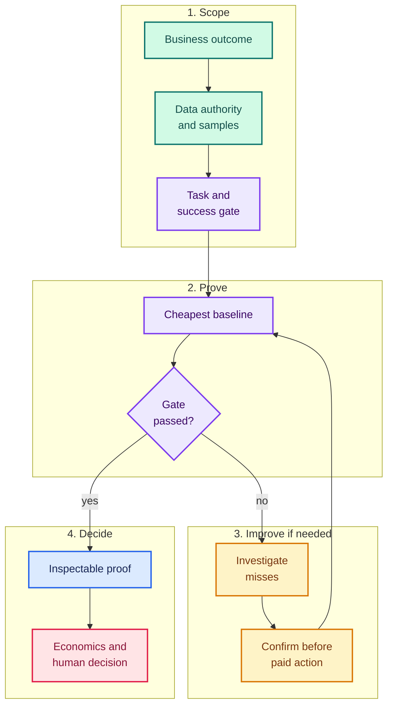

# 🛡️ Sentinel: the business-first computer-vision delivery copilot

[](https://results.pre-commit.ci/latest/github/Borda/vision-delivery/main) [](https://borda.github.io/vision-delivery/) [](https://github.com/Borda/vision-delivery/actions/workflows/docs.yml) [](https://github.com/Borda/vision-delivery/actions/workflows/evals.yml) [](https://www.apache.org/licenses/LICENSE-2.0)

`vision-delivery` ships the `sentinel` plugin for Codex and Claude Code. Tell it the operational outcome you need from images or video; it helps turn that request into a measurable computer-vision proof, checks a baseline before recommending training, and frames the cost and next decision.

Sentinel is designed to lower the computer-vision methodology burden. You do not need to arrive knowing model families, metric names, or Roboflow APIs. You still own four things the plugin cannot infer safely: permission to use the data, the business outcome, representative examples, and the consequence of a wrong answer. Production acceptance remains a human decision.

```text
"Count pallets crossing this line and report the hourly total. I have 60 sample frames.
A missed pallet is worse than a duplicate count."
```

Sentinel should turn that into a task definition, success gate, baseline, evidence artifact, and go/no-go recommendation—not a model shopping list.

## 🧭 What it can support today

| Support tier               | Meaning                                                                                             | Current scope                                                                                                                                                                        |
| -------------------------- | --------------------------------------------------------------------------------------------------- | ------------------------------------------------------------------------------------------------------------------------------------------------------------------------------------ |
| **🕰️ Historical evidence** | A recorded result exists with its original limits; it is not a current support guarantee.           | One pre-v0.2 Claude routing run, a synthetic process A/B, and one small private detection fixture.                                                                                   |
| **🧩 Guided**              | The plugin contains a structured workflow, but the route lacks equivalent live end-to-end evidence. | Detection, classification, tracking, OCR, segmentation, pose/gesture, multi-step decomposition, delivery, and economics.                                                             |
| **🔗 Delegated upstream**  | Sentinel frames and evaluates the work; current product details come from the official source.      | Roboflow MCP operations, model IDs, Workflows, plans, pricing, and platform navigation.                                                                                              |
| **🧑‍⚖️ Expert required**     | Do not rely on the plugin alone.                                                                    | Regulated or safety-critical decisions, people surveillance, medical use, physical measurement, production streaming/edge architecture, legal review, and final production sign-off. |

Read [Support, Scope, and Evidence](docs/support-and-scope.md) before treating a guided route as production-ready.

## 📊 Evidence, without the headline inflation

- **Historical routing sample:** one pre-v0.2 Claude Sonnet run over 143 labeled prompts reported micro precision `0.94` and recall `0.85`: 63 true positives, 4 false positives, and 11 false negatives. Direct specialist routes raised tolerant positive coverage to 65/74 (`0.88`), but four negative prompts still fired incorrectly. The run predates `deliver-cv-project` and `check-sentinel-setup`; it is not evidence for the current route set, Codex, or user outcomes. See [`2026-07-10-full-summary.txt`](evals/trigger-live/runs/2026-07-10-full-summary.txt).
- **Process A/B:** 16 mocked runs, one repeat per cell. One cell supported the preregistered hypothesis, six were mixed/parity, and one was a loss. The result is directional because `N=1`, the environment was developer-contaminated, and live capability confirmation is pending. See [A/B benchmark](docs/benchmarks/ab-plugin-vs-plain.md).
- **CV fixture:** B1 contains measured post-training evidence on 11 private test images. It does not establish conveyor-domain equivalence, a controlled plain-agent advantage, or broad modality coverage. B2-B5 are specifications with live measurements pending. See [benchmark status](docs/benchmarks/index.md).

No novice user study has been run. Sentinel is intended to reduce the entry barrier; the repository does not yet prove that a novice can independently reach a production result.

## 🚀 Quick start

The v0.2 package has passed local clean-home marketplace simulations with the commands below. The public-GitHub path remains unverified until these files are published to `main` and retested there.

### 🤖 Codex marketplace install

```bash
codex plugin marketplace add https://github.com/Borda/vision-delivery
codex plugin add sentinel@sentinel
```

### 🧠 Claude Code marketplace install

```bash
claude plugin marketplace add Borda/vision-delivery
claude plugin install sentinel@sentinel
```

For plugin development from a checkout, validate with `claude plugin validate .` and launch with `claude --plugin-dir .`.

No credential environment variable is required for plugin installation. Codex metadata requests authorization on first use, and the URL-only MCP connection is expected to use the host-managed sign-in flow; actual host/account authorization remains a live check. If a generated standalone client later requires credentials, follow current official Roboflow guidance; never paste credentials into chat or commit them.

## 🔁 The delivery loop



1. Read the project and representative samples.
2. Translate the business request into boxes, labels, text, masks, tracks, or keypoints.
3. Agree on a metric, threshold, sample slice, and consequence of failure.
4. Measure a pretrained or existing baseline before training.
5. Investigate misses and try the cheapest justified improvement.
6. Ask before credit-spending training or deployment actions.
7. Produce local proof artifacts and an evidence-bound recommendation.
8. Estimate economics and leave production acceptance to the user.

Generated scripts, eval files, and ledger rows are requested workflow outputs, not proof that they were created correctly or ran successfully. Inspect and execute them in your own environment before relying on them.

## 🤝 Sentinel and official Roboflow skills

Sentinel owns the delivery question: *What should we build, what evidence would be enough, and what decision follows?*

Roboflow owns current product truth: MCP tool semantics, model families and IDs, Workflows, platform navigation, account plans, and current pricing. Use the installed official [`roboflow/computer-vision-skills`](https://github.com/roboflow/computer-vision-skills) content first, then `roboflow://skills/...` MCP resources when exposed. If neither is available, mark platform-specific guidance unverified.

Installing two full plugins can duplicate a `roboflow` MCP server definition on hosts that do not deduplicate configuration. See [Roboflow Skills Integration](docs/roboflow-skills.md) before combining them.

## ⚠️ Safety boundary

The paid-action confirmation is an instruction to the agent, not a machine-enforced block. The hook and local ledger improve reconstruction but are not complete telemetry or authorization controls.

Before work involving faces, license plates, people tracking, forms, medical imagery, worker monitoring, or other sensitive data, require all of the following:

- documented authority and allowed purpose,
- minimum necessary data and retention rules,
- a representative, bias-aware evaluation set,
- a named human reviewer and appeal/override path,
- legal, privacy, and security review appropriate to the consequences.

Do not use Sentinel as the sole basis for medical, employment, law-enforcement, access-control, or physical-safety decisions. Read [Trust and Safety](docs/trust.md) and the [security policy](.github/SECURITY.md).

## 📚 Project resources

- [Documentation](https://borda.github.io/vision-delivery/)
- [Quick start](docs/quickstart.md)
- [Use cases](docs/use-cases.md)
- [Support, scope, and evidence](docs/support-and-scope.md)
- [Benchmarks](docs/benchmarks/index.md)
- [Contributing](.github/CONTRIBUTING.md)
- [Support policy](.github/SUPPORT.md)
- [Compatibility](docs/compatibility.md)
- [Release policy](docs/release-policy.md)
- [Security](.github/SECURITY.md)
- [Changelog](CHANGELOG.md)

💡 Have a reproducible bug or actionable suggestion? [Open an issue](https://github.com/Borda/vision-delivery/issues/new/choose). External pull requests are temporarily paused while CI and contribution rules are fortified. Do not attach secrets, private customer data, faces, license plates, medical data, or media you are not authorized to share.

Released under Apache-2.0. See [CITATION.cff](CITATION.cff) for citation metadata and [NOTICE](NOTICE) for redistribution notices.
