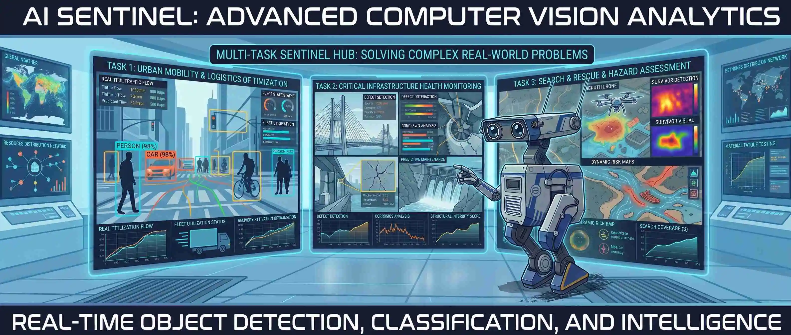
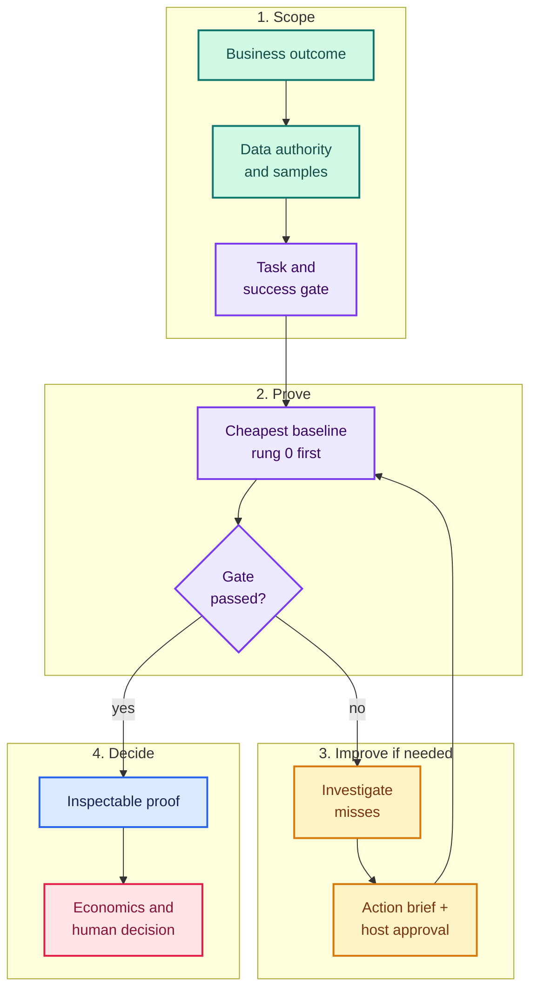

# 🛡️ Sentinel: the computer-vision copilot that won't burn your credits or overclaim

[](https://results.pre-commit.ci/latest/github/Borda/vision-delivery/main) [](https://borda.github.io/vision-delivery/) [](https://github.com/Borda/vision-delivery/actions/workflows/docs.yml) [](https://github.com/Borda/vision-delivery/actions/workflows/evals.yml) [](https://www.apache.org/licenses/LICENSE-2.0)



`vision-delivery` ships the `sentinel` plugin for Claude Code and Codex. It is a delivery-discipline layer on top of [Roboflow](https://roboflow.com) and the official [Roboflow skills](https://github.com/roboflow/computer-vision-skills). You describe the outcome you need from images or video. Sentinel locks a success target, measures the cheapest baseline first, and gives you an auditable go / revise / stop decision. Paid or state-changing Roboflow actions need a written action brief and your approval.

```text
"Count pallets crossing this line and report the hourly total. I have 60 sample frames.
A missed pallet is worse than a duplicate count."
```

## ⏱️ A first answer in minutes, with no account

The first session runs in **explore mode**. You get plain-language numbers and no proof-chain ceremony.

1. Sentinel reads your files and asks at most three business questions, such as "out of 100 real cases, how many misses are acceptable?".
2. It locks that target before looking at any result.
3. It runs **rung 0** of the [baseline ladder](resources/baseline-ladder.md). The host model looks at your labeled sample images, and [`score_baseline.py`](resources/scripts/score_baseline.py) scores the answers. No sign-in, upload, or spend is needed.
4. You get one line, for example: *"Real cases caught: 85% on 40 images (target ≥ 80%): PASS"*, plus what to try next.

Only when the result heads for production, a third party, or a paid action does Sentinel switch to **deliver mode**: frozen acceptance files, digest-bound evidence, and validated handoffs. See [delivery modes](resources/delivery-modes.md).

## 💳 Spend protection you can check

On **Claude Code**, Sentinel installs a `PreToolUse` hook ([`hooks/gate.js`](hooks/gate.js)) on every Roboflow MCP tool:

- uploads, dataset versions, training, deployment, and deletion are **denied** until a sourced action brief (scope, data movement, dated cost estimate) is recorded in the project ledger;
- with a brief, the call goes to **your host permission prompt**. The gate never auto-approves, and one brief covers one execution;
- in `bypassPermissions`, `dontAsk`, and `auto` modes, such calls are denied, because no human prompt is guaranteed there.

On **Codex**, no verified pre-action hook exists, so Sentinel writes the brief and stops; you execute it yourself. The gate is a guard, not a budget. Keep account budgets and a non-production workspace too.

## 🚀 Install

```bash
# Claude Code
claude plugin marketplace add Borda/vision-delivery
claude plugin install sentinel@sentinel

# Codex
codex plugin marketplace add https://github.com/Borda/vision-delivery
codex plugin add sentinel@sentinel
```

No credential environment variable is needed. Roboflow sign-in uses the host-managed MCP flow the first time a live Roboflow action runs. Never paste credentials into chat or commit them. For plugin development, run `claude plugin validate .` and `claude --plugin-dir .` from a checkout.

## 🎯 Routes

| Status       | Route                                                         | Use it for                                     |
| ------------ | ------------------------------------------------------------- | ---------------------------------------------- |
| **Flagship** | `detect-and-analyze`                                          | counting and finding objects or defects        |
| **Flagship** | `classify-or-flag`                                            | one pass/fail or category verdict per image    |
| Guided       | `estimate-economics`, `deliver-cv-project`, `decision-report` | cost, packaging, and the final decision record |
| Preview      | `track-and-count`, `read-text`, `segment-and-analyze`         | tracking over time, OCR, masks and measurement |
| Preview      | `recognize-pose-or-gesture`, `decompose-to-pipeline`          | keypoints and multi-stage systems              |

Flagship routes are the ones being taken to live end-to-end proof on public data first. Preview routes have a full workflow but less evidence; use them with more caution. Start with `solve-cv-task` (Claude Code: `/sentinel:solve-cv-task`) when you are unsure which route fits.

## 📋 Honest status

> **v0.5 release candidate.** The v0.5 release candidate passed local clean-home marketplace simulations. Manual public-GitHub marketplace installation was recorded for v0.3 on Codex and Claude Code; the v0.5 public-install path remains unverified.
>
> Evidence so far: one pre-v0.2 live routing run (precision `0.94`, recall `0.85` on 143 prompts), a mocked plugin-vs-plain A/B at one run per cell, and one small private detection result. No novice user study has been run, and live end-to-end results for the flagship routes are pending. Read [Support & Evidence](https://borda.github.io/vision-delivery/support-and-scope/) before relying on any route in production.

Tried it? [Tell us how it went](https://github.com/Borda/vision-delivery/issues/new?template=outcome-report.yml). Outcome reports from real projects are the most useful thing you can send right now.

## 🔁 The delivery loop


```mermaid
flowchart TB
    subgraph SCOPE[1. Scope]
        direction LR
        A[Business outcome] --> B[Data authority<br/>and samples]
        B --> C[Task and<br/>success gate]
    end

    subgraph PROVE[2. Prove]
        direction LR
        D[Cheapest baseline<br/>rung 0 first] --> E{Gate<br/>passed?}
    end

    subgraph IMPROVE[3. Improve if needed]
        direction LR
        G[Investigate<br/>misses] --> H[Action brief +<br/>host approval]
    end

    subgraph DECIDE[4. Decide]
        direction LR
        F[Inspectable proof] --> I[Economics and<br/>human decision]
    end

    C --> D
    E -->|yes| F
    E -->|no| G
    H --> D

    classDef user fill:#D1FAE5,stroke:#0F766E,color:#134E4A,stroke-width:2px;
    classDef sentinel fill:#EDE9FE,stroke:#7C3AED,color:#3B0764,stroke-width:2px;
    classDef improve fill:#FEF3C7,stroke:#D97706,color:#78350F,stroke-width:2px;
    classDef evidence fill:#DBEAFE,stroke:#2563EB,color:#172554,stroke-width:2px;
    classDef decision fill:#FFE4E6,stroke:#E11D48,color:#881337,stroke-width:2px;

    class A,B user;
    class C,D,E sentinel;
    class G,H improve;
    class F evidence;
    class I decision;
```

Generated scripts, eval files, and ledger rows are workflow outputs, not proof that they are correct or that they ran. Inspect and run them in your own environment before relying on them.

## 🤝 Sentinel and official Roboflow skills

Sentinel owns the delivery question: *what should we build, what evidence is enough, and what decision follows?* Roboflow owns current product truth: MCP tool semantics, model IDs, Workflows, plans, and pricing. Sentinel reads the installed official Roboflow skills first, then `roboflow://skills/...` MCP resources. When neither is available, it marks platform details unverified. Installing both full plugins can duplicate the `roboflow` MCP server on hosts that do not deduplicate; see [Roboflow Skills Integration](https://borda.github.io/vision-delivery/roboflow-skills/).

## ⚠️ Safety boundary

Before work involving faces, license plates, people tracking, forms, medical imagery, worker monitoring, or other sensitive data, require all of the following:

- documented authority and allowed purpose,
- minimum necessary data and retention rules,
- a representative, bias-aware evaluation set,
- a named human reviewer and appeal/override path,
- legal, privacy, and security review appropriate to the consequences.

Do not use Sentinel as the sole basis for medical, employment, law-enforcement, access-control, or physical-safety decisions. Read [Trust and Safety](https://borda.github.io/vision-delivery/trust/) and the [security policy](https://github.com/Borda/vision-delivery/blob/main/.github/SECURITY.md).

## 📚 Project resources

- [Documentation](https://borda.github.io/vision-delivery/) · [Quick start](https://borda.github.io/vision-delivery/quickstart/) · [Use cases](https://borda.github.io/vision-delivery/use-cases/)
- [First-baseline example](https://github.com/Borda/vision-delivery/tree/main/examples/first-baseline)
- [Support, scope, and evidence](https://borda.github.io/vision-delivery/support-and-scope/) · [Benchmarks](https://borda.github.io/vision-delivery/benchmarks/)
- [Compatibility](https://borda.github.io/vision-delivery/compatibility/) · [Release policy](https://borda.github.io/vision-delivery/release-policy/) · [Changelog](https://github.com/Borda/vision-delivery/blob/main/CHANGELOG.md)
- [Contributing](https://github.com/Borda/vision-delivery/blob/main/.github/CONTRIBUTING.md) · [Support policy](https://github.com/Borda/vision-delivery/blob/main/.github/SUPPORT.md) · [Security](https://github.com/Borda/vision-delivery/blob/main/.github/SECURITY.md)

💡 Found a reproducible bug or have a suggestion? [Open an issue](https://github.com/Borda/vision-delivery/issues/new/choose). External pull requests are paused for now while CI and contribution rules are hardened. Do not attach secrets, private customer data, faces, license plates, medical data, or media you are not authorized to share.

Released under Apache-2.0. See [CITATION.cff](https://github.com/Borda/vision-delivery/blob/main/CITATION.cff) for citation metadata and [NOTICE](https://github.com/Borda/vision-delivery/blob/main/NOTICE) for redistribution notices.
