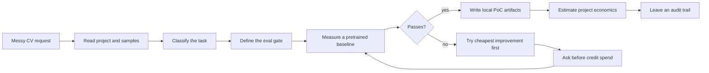

# Solve real CV tasks with measured proof

<section class="vd-hero">
  <p class="vd-kicker">Codex and Claude Code plugin for real computer-vision delivery</p>
  <p class="vd-title">vision-delivery</p>
  <p class="vd-lede">
    <strong>vision-delivery</strong> turns a vague camera, image, or video request into a scoped Roboflow proof of concept with an eval gate, local artifacts, paid-action guardrails, and a concrete economics decision.
  </p>
  <p class="vd-actions">
    <a class="vd-button" href="#quick-start">Quick start</a>
    <a class="vd-button" href="#features">See features</a>
    <a class="vd-button" href="benchmarks/">Benchmark evidence</a>
  </p>
</section>

<div class="vd-proof-strip" aria-label="Project proof points">
  <div><strong>2 hosts</strong><span>Codex + Claude Code</span></div>
  <div><strong>6 CV routes</strong><span>detect, flag, track, OCR, segment, pose</span></div>
  <div><strong>1 measured benchmark</strong><span>B1 live evidence, B2-B5 fixtures</span></div>
  <div><strong>Consent-gated flow</strong><span>skills instruct confirmation before paid actions</span></div>
</div>

## Why This Exists

Computer-vision projects often fail before the model fails. The request starts as "Can AI count this?" but the real decision is still missing: which object counts, what error rate is acceptable, whether a pretrained model is enough, what a missed detection costs, and whether labeling, training, or deployment is economically justified.

`vision-delivery` makes that careful sequence the default. It reads the project, classifies the CV task, defines the eval before model search, tries the cheapest useful baseline, confirms before paid actions, writes local proof artifacts, and leaves a ledger so the work can be audited later.

!!! note "The value proposition"

    A plain agent with Roboflow MCP access can train, evaluate, and deploy. The plugin's value is not magic accuracy. The value is that eval-first discipline, cost ordering, provenance, and safety gates are built into the workflow instead of depending on the user to ask for them.

!!! tip "How this relates to Roboflow's official skills"

    Roboflow's [`computer-vision-skills`](https://github.com/roboflow/computer-vision-skills) plugin should own product truth: platform navigation, Workflows, model IDs, inference modes, training options, and pricing references. `vision-delivery` owns delivery discipline: problem framing, eval gates, local proof artifacts, provenance, and economics. Read [Roboflow Skills Integration](roboflow-skills.md) before treating one package as a full replacement for the other.

## Quick Start

Install the plugin in either host, make `ROBOFLOW_API_KEY` available to the host process that starts the Roboflow MCP server, then begin with an operational CV task.

=== "Codex"

    ```bash
    codex plugin marketplace add https://github.com/Borda/vision-delivery
    codex plugin add vision-delivery@vision-delivery
    export ROBOFLOW_API_KEY=your_key_here
    ```

=== "Claude Code"

    ```bash
    claude plugin install https://github.com/Borda/vision-delivery
    echo "ROBOFLOW_API_KEY=your_key_here" >> .env
    echo ".env" >> .gitignore
    ```

Get a key at [app.roboflow.com/settings/api](https://app.roboflow.com/settings/api), restart Codex or Claude Code, and ask for the camera, object, and output you need:

```text
I have an overhead camera above a parking lot. I need to count vehicles in view.
```

Good starting prompts are operational rather than model-first:

```text
Count pallets on a conveyor from these 60 sample frames.
Detect cracks in product photos and report the count per image.
Read serial numbers from circuit board images and write a local inference script.
Track shoppers through aisle zones and estimate dwell time from RTSP footage.
```

Read the full [Quick Start](quickstart.md) for setup, key handling, first prompts, and expected first-session behavior.

## Features

<div class="vd-grid">
  <article>
    <h3>Problem-first routing</h3>
    <p><code>solve-cv-task</code> separates detection, classification, tracking, OCR, segmentation, and pose before model search starts.</p>
  </article>
  <article>
    <h3>Eval-first workflow</h3>
    <p>The plugin asks for the success threshold and records it before training or deployment advice can move forward.</p>
  </article>
  <article>
    <h3>Pretrained baseline first</h3>
    <p>Roboflow MCP and Universe candidates are measured before labeling or training so an existing model can win quickly when it is good enough.</p>
  </article>
  <article>
    <h3>Cheapest improvement first</h3>
    <p>Threshold tuning comes before fine-tuning, and fine-tuning comes before larger data work unless the evidence says otherwise.</p>
  </article>
  <article>
    <h3>Explicit credit gate</h3>
    <p>Skills instruct the agent to get confirmation with cost impact before training or deployment-class actions.</p>
  </article>
  <article>
    <h3>Local proof artifacts</h3>
    <p>Workflows are designed to leave runnable scripts, eval definitions, detections, and ledger records instead of only chat history.</p>
  </article>
  <article>
    <h3>Audit trail</h3>
    <p>Selected train, eval, and deploy events are appended to <code>.vision-delivery/ledger.jsonl</code> for reporting and review.</p>
  </article>
  <article>
    <h3>CV economics</h3>
    <p><code>estimate-economics</code> frames annotation, training, managed deployment, and self-hosting as one decision with assumptions visible.</p>
  </article>
</div>

## How The Solver Works



The workflow is intentionally conservative because the expensive mistake is solving the wrong task.

1. **Read the context:** inspect relevant files, sample images, annotations, and constraints.
2. **Classify the CV job:** choose the right route and clarify ambiguous wording.
3. **Define the eval:** capture the metric, threshold, dataset slice, and failure consequence.
4. **Measure a baseline:** try pretrained or Universe candidates against the gate.
5. **Improve in cost order:** tune thresholds, then consider training, then recommend data work.
6. **Write the PoC:** produce local inference and eval artifacts the user can inspect.
7. **Estimate economics:** compare annotation, training, managed deployment, and self-hosting assumptions.
8. **Record provenance:** append train, eval, and deploy records for audit and reporting.

Read the full [Workflow](workflow.md) guide for the eval-first sequence and artifact expectations.

## Use Cases

| User asks for                         | Route                       | What gets measured                       |
| ------------------------------------- | --------------------------- | ---------------------------------------- |
| Count objects, defects, vehicles      | `detect-and-analyze`        | mAP@50, per-class count MAE              |
| Pass/fail or compliance flag          | `classify-or-flag`          | precision, recall, F1                    |
| Track people, dwell time, line-cross  | `track-and-count`           | MOTA, dwell time MAE, line-cross counts  |
| Read serials, labels, dates, barcodes | `read-text`                 | field match rate, CER, latency           |
| Segment cracks, lesions, corrosion    | `segment-and-analyze`       | mask mAP, IoU, area or width error       |
| Recognize posture, gesture, action    | `recognize-pose-or-gesture` | OKS mAP, gesture recall                  |
| Monitor a multi-step visual process   | `decompose-to-pipeline`     | typed handoffs between specialist routes |
| Price the project decision            | `estimate-economics`        | one-time assumptions and run-rate costs  |

Read the full [Use Cases](use-cases.md) guide for route boundaries and examples.

## Example Session

> User: "Count cracked items on my packaging line. I have 40 sample images."
>
> Plugin: "This is an object-instance detection/counting task: one box per visible crack, count per image. What recall floor do you need?"
>
> User: "80% recall. A missed crack reaches the customer."
>
> Plugin: "Eval defined: recall >= 80% on your 40 images. Measuring a pretrained candidate."
>
> Plugin: "Baseline result: 74% recall. Fastest lever is a confidence threshold sweep."
>
> Plugin: "Best threshold reaches 83% recall. Eval passes. Writing the local PoC and ledger entry."

## What Makes It Different

| Common failure mode                            | What `vision-delivery` enforces                                                                                     |
| ---------------------------------------------- | ------------------------------------------------------------------------------------------------------------------- |
| The user asks for "AI" instead of a CV task.   | The router narrows the request to a concrete detection, OCR, tracking, segmentation, pose, or classification job.   |
| Success is judged after seeing a demo.         | The eval gate is defined before model search or training.                                                           |
| Training starts before a baseline is measured. | Pretrained candidates are measured first.                                                                           |
| Paid actions happen too casually.              | Skills instruct the agent to ask for explicit confirmation and log train/deploy events afterward.                   |
| Results live only in chat history.             | Artifacts and ledger entries are written locally.                                                                   |
| Economic advice is based on memory or vibes.   | Deployment run-rate comes from a script and dated pricing snapshots; annotation and training assumptions are named. |

## CV Economics

After a model passes the eval gate, invoke the economics recipe:

```text
/vision-delivery:estimate
```

`estimate-economics` reads the project and separates one-time work from run-rate costs:

- **Annotation and QA:** sample count, labeled/unlabeled split, class count, and user-provided or project-backed assumptions.
- **Training and eval:** training history, likely retraining cadence, and previous run evidence when available.
- **Deployment run-rate:** stream count, FPS, uptime, region, model size, and existing GPU availability.
- **Decision output:** managed vs DIY recommendation, crossover point, sources, and editable assumptions.

Deployment run-rate is calculated by `scripts/cost_model.py` using the committed `scripts/PRICING_SNAPSHOT.json` plus explicit overrides:

```bash
python scripts/cost_model.py --streams 5 --fps 10 --model-size medium --uptime 24x7 --region us-east-1
```

The script probes source reachability but does not scrape live pricing into the result. That keeps output reproducible and makes stale pricing visible.

Read the full [CV Economics](economics.md) guide for assumptions, cost areas, and decision report structure.

## Benchmarks And Evidence

The benchmark suite anchors docs claims in reproducible CV work. B1 has measured evidence; B2-B5 define fixtures and acceptance criteria for other routes.

| #   | Problem                 | Route                 | Evidence        |
| --- | ----------------------- | --------------------- | --------------- |
| B1  | Conveyor / aerial count | `detect-and-analyze`  | Measured        |
| B2  | PPE compliance          | `classify-or-flag`    | Fixture defined |
| B3  | Shopper tracking        | `track-and-count`     | Fixture defined |
| B4  | Serial number OCR       | `read-text`           | Fixture defined |
| B5  | Crack width measurement | `segment-and-analyze` | Fixture defined |

Read the [benchmark documentation](benchmarks/index.md) for fixtures, thresholds, caveats, and reproduction notes.

!!! warning "Evidence boundary"

    The measured benchmark validates the eval-first Roboflow delivery path on that fixture. It does not claim that the plugin has a model-quality advantage over any agent using the same tools. The plugin's claim is process discipline: threshold first, baseline first, instructed confirmation before paid actions, and auditable artifacts.

## Security And Trust

This package touches API keys and paid Roboflow actions, so the safety model is part of the product:

- Keep `ROBOFLOW_API_KEY` in the host environment or `.env`; never paste it in chat.
- `.mcp.json` passes the key to the Roboflow MCP server through the `x-api-key` header.
- Skills instruct the agent to get explicit confirmation before training and deployment-class spend. This is not a runtime-enforced block; see the known limitation in [Trust And Safety](trust.md).
- The PostToolUse hook writes local JSONL records under `.vision-delivery/`; it does not make network calls.
- Read the repository [security policy](https://github.com/Borda/vision-delivery/blob/main/SECURITY.md) before reporting vulnerabilities.

Read [Trust And Safety](trust.md) for key handling, prose-enforced paid-action gates, ledger boundaries, pricing provenance, and evidence limits.

## Deep Dives

| Page                         | Use it when you need                                       |
| ---------------------------- | ---------------------------------------------------------- |
| [Quick Start](quickstart.md) | install commands, key setup, first prompt examples         |
| [Use Cases](use-cases.md)    | route selection by output type and eval metric             |
| [Workflow](workflow.md)      | the eval-first delivery sequence and artifact lifecycle    |
| [CV Economics](economics.md) | annotation, training, deployment, and DIY/managed tradeoff |
| [Roboflow Skills](roboflow-skills.md) | when to use this plugin, Roboflow's official skills, or both |
| [Trust](trust.md)            | API keys, prose-enforced spend gates, ledger behavior      |
| [FAQ](faq.md)                | fast answers for humans, search engines, and agents        |

## Agent-Friendly Map

For humans, start with the quick start and use-case table. For agents, these are the canonical entry points:

```text
vision-delivery/
├── skills/solve-cv-task/              # canonical CV task router
├── skills/estimate-economics/         # canonical CV economics recipe
├── skills/detect-and-analyze/         # object detection and counting
├── skills/classify-or-flag/           # image-level pass/fail workflows
├── skills/track-and-count/            # video tracking and dwell/line counts
├── skills/read-text/                  # OCR and structured text extraction
├── skills/segment-and-analyze/        # masks, contours, and measurement
├── skills/recognize-pose-or-gesture/  # keypoints, posture, gestures
├── agents/cv-problem-solver.md        # Claude Code adapter for solve-cv-task
├── agents/economics-consultant.md     # Claude Code adapter for estimate-economics
├── hooks/cta.js                       # PostToolUse ledger hook
└── evals/trigger/                     # structural trigger coverage
```

Machine-readable discovery files are also published with the docs:

- [`llms.txt`](llms.txt) — compact curated map for LLMs and coding agents.
- [`llms-full.txt`](llms-full.txt) — longer project context for agents with larger context windows.
- [`robots.txt`](robots.txt) — project-path crawl hint and sitemap discovery.
