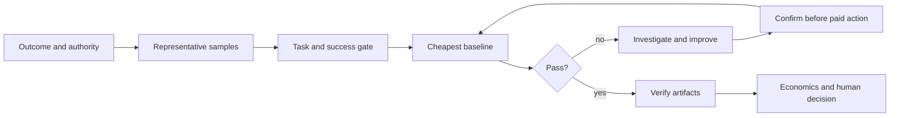

# Start with the business problem, not a model

<section class="vd-hero">
  <p class="vd-kicker">Computer-vision delivery copilot for Codex and Claude Code</p>
  <h2>Describe what you need to see, count, read, track, or measure.</h2>
  <p>
    <strong>Sentinel</strong> turns that operational request into a CV task, a success gate, the cheapest sensible baseline, inspectable proof artifacts, and an evidence-bound economics decision.
  </p>
  <p>
    <a class="md-button md-button--primary" href="quickstart.md">Start a first proof</a>
    <a class="md-button" href="support-and-scope.md">Check support and evidence</a>
  </p>
</section>

You do not need to know model families, metric names, or Roboflow APIs before starting. You do need authority to use the data, representative examples, the business consequence of errors, and a human who owns the result.

```text
Count pallets crossing this line and report the hourly total. I have 60 sample
frames. A missed pallet is worse than a duplicate count.
```

The expected answer is not a list of models. Sentinel should clarify the output, translate the consequence into a proposed eval, measure a baseline, and recommend the least costly next step.

## What Sentinel owns

<div class="vd-card-grid">
  <article class="vd-card">
    <h3>Business-to-CV translation</h3>
    <p>Turn plain-language outcomes into boxes, labels, text, masks, tracks, keypoints, and measurable decisions.</p>
  </article>
  <article class="vd-card">
    <h3>Evidence before spend</h3>
    <p>Commit the success gate, measure an existing baseline, and investigate misses before training or deployment.</p>
  </article>
  <article class="vd-card">
    <h3>Inspectable handoff</h3>
    <p>Request local eval, script, result, provenance, and economics artifacts that a human can verify.</p>
  </article>
</div>

Sentinel does not own current Roboflow product truth. Exact MCP behavior, model IDs, Workflows, platform navigation, plans, and prices should come from installed official [Roboflow skills](https://github.com/roboflow/computer-vision-skills), then exposed `roboflow://skills/...` resources. Read [Roboflow Skills Integration](roboflow-skills.md).

## Support tiers

| Tier                    | Current meaning                                                                                                                                                                 |
| ----------------------- | ------------------------------------------------------------------------------------------------------------------------------------------------------------------------------- |
| **Historical evidence** | Recorded pre-v0.2 routing, synthetic process, and private detection results with disclosed limits; not a current support guarantee.                                             |
| **Guided**              | Structured routes exist for detection, classification, tracking, OCR, segmentation, pose/gesture, pipelines, delivery, and economics; equivalent live evidence does not exist.  |
| **Delegated upstream**  | Use official Roboflow sources for current platform/API/model/plan truth while Sentinel frames and evaluates the delivery decision.                                              |
| **Expert required**     | Regulated or safety-critical use, people surveillance, medical work, physical measurement, production streaming/edge architecture, legal review, and final production sign-off. |

The full route-by-route claim register is in [Support, Scope, and Evidence](support-and-scope.md).

## Install

=== "Codex"

    ```bash
    codex plugin marketplace add https://github.com/Borda/vision-delivery
    codex plugin add sentinel@sentinel
    ```

=== "Claude Code"

    ```bash
    claude plugin marketplace add Borda/vision-delivery
    claude plugin install sentinel@sentinel
    ```

Each host uses two commands. The v0.2 package has passed local clean-home marketplace simulations; the public-GitHub path remains unverified until these files are published and retested from `main`. No credential environment variable is required for plugin installation. When the host or account requires it, using the MCP capability requests hosted authorization; an existing authorized session may need no prompt. For Claude plugin development from a checkout, use `claude plugin validate .` and `claude --plugin-dir .`. Never paste credentials into chat.

## Delivery loop



Generated scripts, IDs, eval files, and ledger rows are not self-validating. Inspect and execute them on a representative fixture, compare observed outputs with the committed gate, and record failures before calling a proof complete.

## Evidence today

- **Historical routing:** one pre-v0.2 Claude Sonnet run over 143 prompts reported precision `0.94` and recall `0.85`, with 4 false positives and 11 false negatives. It excludes the delivery and setup routes and is not current-route, Codex, or task-completion evidence.
- **Synthetic process A/B:** 16 mocked runs at one repeat per cell produced 1 supported cell, 6 mixed/parity cells, and 1 loss. It is directional, developer-contaminated process evidence—not live model quality.
- **B1 detection:** a recorded result on 11 private test images. It lacks a controlled comparator, post-train count MAE, public independent reproduction, and verified transfer to the intended conveyor domain.
- **B2-B5:** benchmark specifications only; live results pending.
- **Entry barrier:** no independent novice study yet measures completion, recovery, or safe decisions.

See [Benchmarks and Evidence](benchmarks/index.md) for sources and promotion gates.

## Safety before capability

Paid-action confirmation is an agent instruction, not a hard authorization control. Use host approvals, least-privilege account authorization or sessions, account budgets, and non-production workspaces. If a separately generated standalone client requires a key, follow the provider's current guidance and scope that key to the minimum permissions.

For faces, license plates, people tracking, forms, medical imagery, worker monitoring, minors, or location-linked media, stop until authority, purpose, minimization, retention, representative evaluation, named human review, and appropriate legal/security/domain checks exist. Sentinel must not be the sole decision-maker for medical, employment, law-enforcement, access-control, or physical-safety outcomes.

Read [Trust and Safety](trust.md) and the repository [security policy](https://github.com/Borda/vision-delivery/blob/main/.github/SECURITY.md).

## Continue

| Need                                  | Read                                                                                    |
| ------------------------------------- | --------------------------------------------------------------------------------------- |
| Exact first-session commands          | [Quick Start](quickstart.md)                                                            |
| Pick the right output route           | [Use Cases](use-cases.md)                                                               |
| Understand the delivery sequence      | [Workflow](workflow.md)                                                                 |
| Check claims and limitations          | [Support, Scope, and Evidence](support-and-scope.md)                                    |
| Separate Sentinel from platform truth | [Roboflow Skills Integration](roboflow-skills.md)                                       |
| Interpret current proof               | [Benchmarks](benchmarks/index.md)                                                       |
| Get community help                    | [Support policy](https://github.com/Borda/vision-delivery/blob/main/.github/SUPPORT.md) |
