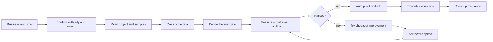

# Eval-First Workflow

The workflow is conservative on purpose. The expensive mistake is not a weak model; it is solving the wrong visual task with no authority, representative evidence, or agreed success threshold.

## 0. Confirm Authority And Ownership

Before private or sensitive data is opened, uploaded, or sent through MCP, establish the allowed purpose, data authority, minimum necessary scope, and the human who owns the result. Stop if those facts are missing for faces, plates, people tracking, forms, medical imagery, worker monitoring, or other consequential uses.

## 1. Read Context

The plugin should inspect relevant project files, sample images, annotations, inference scripts, configs, and user constraints only within the authorized scope before asking broad questions.

## 2. Classify The Task

The router chooses the output type:

- boxes,
- masks,
- tracks,
- keypoints,
- labels,
- text.

Ambiguous wording gets one clarifying question. For example, "count defective items" could mean per-instance detection or per-image classification.

## 3. Define The Eval Gate

The eval gate is committed before model search. It should include:

- metric,
- threshold,
- dataset or sample slice,
- business consequence of failure,
- mode: batch, stream, or endpoint.

## 4. Measure A Baseline

The plugin tries a pretrained or Roboflow Universe candidate before training. If the baseline passes, training is unnecessary. If it fails, the miss pattern determines the next lever.

## 5. Improve In Cost Order

The default improvement order is:

1. threshold or prompt tuning,
2. preprocessing or crop changes,
3. model/backbone switch,
4. fine-tuning,
5. labeling or larger data work.

Skills instruct the agent to ask for explicit confirmation before training and deployment-class spend. This is prose-enforced workflow guidance, not a hard runtime block.

## 6. Write Proof Artifacts

Expected artifacts depend on the route, but common outputs include:

- `eval_definition.md`,
- local inference script,
- `.vision-delivery/detections.jsonl`,
- `.vision-delivery/ledger.jsonl`,
- deployment or workflow IDs after explicit confirmation.

These are requested outputs, not self-validating proof. Inspect each file, run relevant syntax/dependency checks, execute a representative fixture, and compare the observed output with the committed gate. Do not describe an artifact as runnable or a deployment as successful solely because the workflow asked for it or a ledger row exists.

## 7. Estimate Economics

Economics comes after the model is worth taking further or after the user explicitly asks for a rough estimate. The estimate should name assumptions and separate one-time effort from run-rate.

## 8. Record Provenance

The ledger supports reconstruction of selected lifecycle events. Where the host exposes an outcome, records may distinguish success, failure, cancellation, or unknown state. Coverage remains best-effort; the ledger is not complete observability, authorization proof, or an independent receipt from Roboflow.

## 9. Human Acceptance

Production acceptance belongs to the user and relevant domain, privacy, security, and operations owners. Sentinel can organize the evidence but cannot certify that a workload is lawful, fair, calibrated, secure, reliable, or safe.
