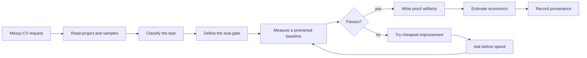

# Eval-First Workflow

The workflow is conservative on purpose. The expensive mistake is not a weak model; it is solving the wrong visual task with no agreed success threshold.

## 1. Read Context

The plugin should inspect relevant project files, sample images, annotations, inference scripts, configs, and user constraints before asking broad questions.

## 2. Classify The Task

The router chooses the output type:

- boxes,
- masks,
- tracks,
- keypoints,
- labels,
- text.

Ambiguous wording gets one clarifying question. For example, "count defective items" could mean per-instance detection or per-image classification.

## 3. Define The Eval Gate

The eval gate is committed before model search. It should include:

- metric,
- threshold,
- dataset or sample slice,
- business consequence of failure,
- mode: batch, stream, or endpoint.

## 4. Measure A Baseline

The plugin tries a pretrained or Roboflow Universe candidate before training. If the baseline passes, training is unnecessary. If it fails, the miss pattern determines the next lever.

## 5. Improve In Cost Order

The default improvement order is:

1. threshold or prompt tuning,
2. preprocessing or crop changes,
3. model/backbone switch,
4. fine-tuning,
5. labeling or larger data work.

Skills instruct the agent to ask for explicit confirmation before training and deployment-class spend. This is prose-enforced workflow guidance, not a hard runtime block.

## 6. Write Proof Artifacts

Expected artifacts depend on the route, but common outputs include:

- `eval_definition.md`,
- local inference script,
- `.vision-delivery/detections.jsonl`,
- `.vision-delivery/ledger.jsonl`,
- deployment or workflow IDs after explicit confirmation.

## 7. Estimate Economics

Economics comes after the model is worth taking further or after the user explicitly asks for a rough estimate. The estimate should name assumptions and separate one-time effort from run-rate.

## 8. Record Provenance

The ledger is for reconstruction later: what was trained, what was evaluated, what deployed, and why. It is not complete observability; it records selected lifecycle events.
